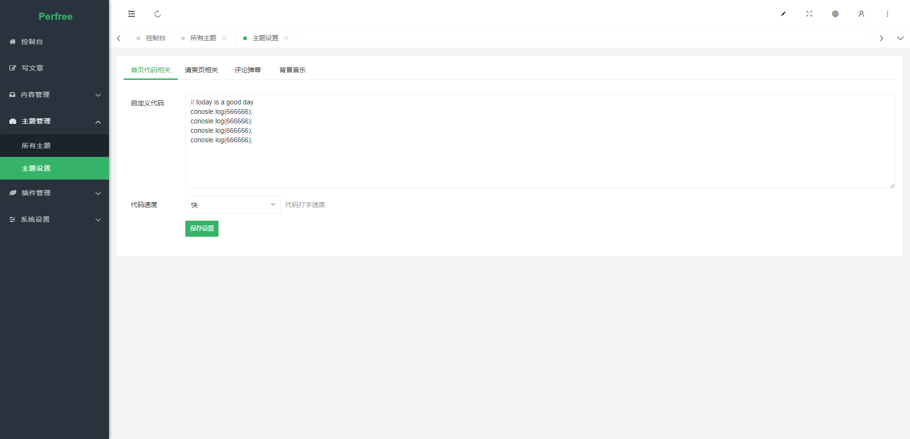
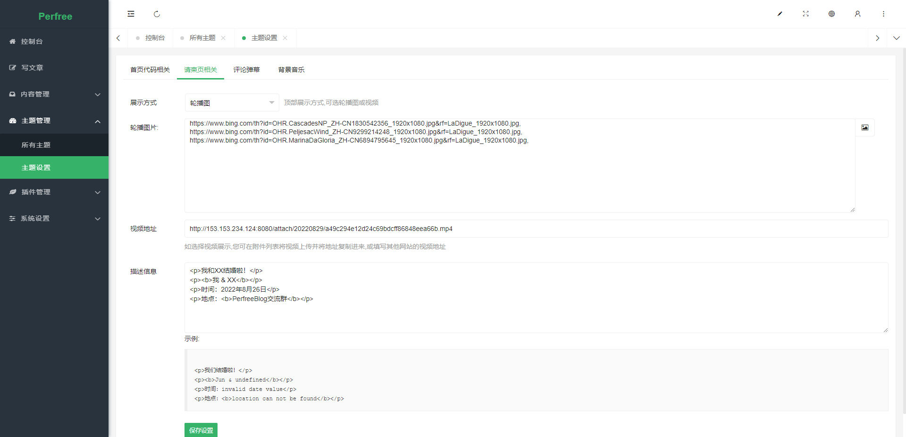

# 程序员的婚礼邀请函
一款移植于https://github.com/leadream/wedding-invitation-for-programmers的PerfreeBlog主题,将所有的信息修改为可自定义化以及额外增加了一些自定义功能






## 开发
### 前提条件
你需要安装 Node.js 环境，具备一定的前端知识。

clone 到本地之后，先安装所有依赖。
```
yarn install
```

再打开开发模式，实时调试。
```
yarn run serve
```

## 构建
构建生产版本。
```
yarn run build
```

## 测试
```
yarn run test
```

## Lints and fixes files
```
yarn run lint
```

# LICENSE
GNU General Public License v3.0